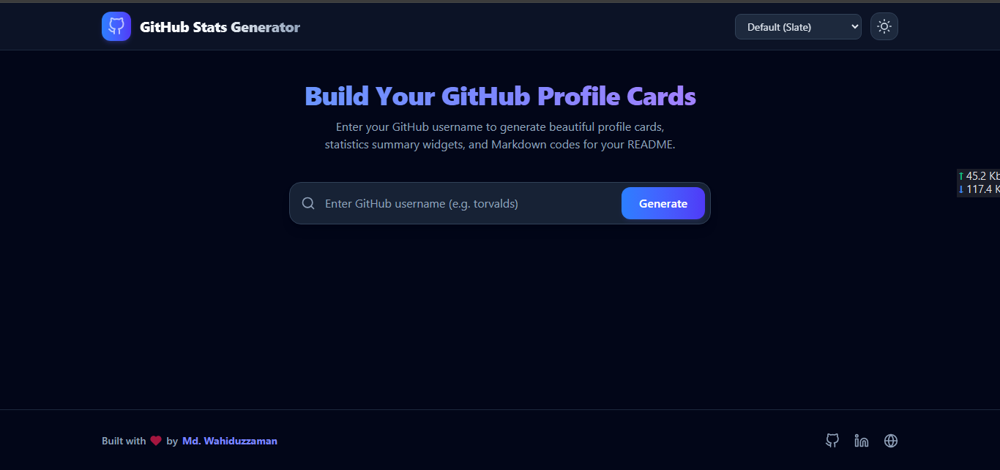

<div align="center">

# 📊 GitHub Stats Generator

**Create beautiful, dynamic GitHub profile cards, statistics summary widgets, and ready-to-use Markdown snippets for your GitHub profile README.**

[](https://github-stats-generator.netlify.app)
[](https://reactjs.org/)
[](https://vitejs.dev/)
[](https://tailwindcss.com/)
[](LICENSE)

<br />



</div>

---

## 🚀 Overview

**GitHub Stats Generator** is a modern, responsive web application built with **React 19**, **Vite**, and **Tailwind CSS**. It allows developers to enter any GitHub username and instantly generate customized statistics cards, top languages charts, contribution streaks, and profile overview widgets. 

Users can customize themes, toggle between Light and Dark (Galaxy) modes, configure custom stats endpoints, and copy markdown code directly to their GitHub profile `README.md`.

---

## ✨ Features

- ⚡ **Instant Profile & Stats Generation**: Real-time fetching of GitHub user profile details, follower counts, repositories, and activity metrics.
- 🎨 **Multiple Color Themes**: Choose between `Default (Slate)`, `Dracula (Purple)`, `Tokyo Night (Indigo)`, `Emerald (Green)`, and `Amber (Orange)`.
- 🌌 **Animated Galaxy Dark Mode**: Immersive dark mode with glowing nebulas, twinkling stars, and shooting star effects.
- ☀️ **Clean Light Mode**: High-contrast, clean light theme with bold black typography for readability.
- 📊 **Dynamic GitHub Cards**:
  - **Profile Card**: Avatar, bio, followers, repositories count, and profile views counter badge.
  - **GitHub Stats Widget**: Total stars, commits, pull requests, issues, and contributions.
  - **Top Languages Chart**: Visual breakdown of most-used programming languages.
  - **Streak Stats Widget**: Current and longest contribution streaks.
- ⚙️ **Configurable Stats API Host**:
  - `Default`: `github-readme-stats`
  - `Alternative`: `github-stats-extended`
  - `Custom`: Enter your own self-hosted Vercel or server endpoint.
  - Toggle options for *All-Time Commits* and *Private Contributions*.
- 📋 **One-Click Markdown Copy**: Instant copy button with fallback support for all browser environments.
- 🔗 **Shareable URL Parameters**: Generate links with `?username=yourname` for direct sharing.

---

## 🛠️ Tech Stack

- **Framework**: [React 19](https://react.dev/)
- **Build Tool**: [Vite](https://vitejs.dev/)
- **Styling**: [Tailwind CSS v4](https://tailwindcss.com/)
- **Icons**: [React Icons](https://react-icons.github.io/react-icons/) (Feather Icons `react-icons/fi`)
- **APIs & Services**:
  - [GitHub REST API](https://docs.github.com/en/rest)
  - [GitHub Readme Stats](https://github.com/anuraghazra/github-readme-stats)
  - [GitHub Readme Streak Stats](https://github.com/DenverCoder1/github-readme-streak-stats)
  - [GitHub Profile Views Counter](https://komarev.com/ghpvc/)

---

## 🔑 GitHub API Rate Limits

By default, unauthenticated client-side requests to the GitHub API are limited to 60 requests per hour per IP. 

If you encounter rate-limit errors during high usage, you can store a personal GitHub token in your browser's `localStorage` under the key `github_token`:

```javascript
localStorage.setItem('github_token', 'your_personal_access_token_here');
```

---

## 👤 Author

**Md. Wahiduzzaman**

- **GitHub**: [@WahiduzzamanSakib](https://github.com/WahiduzzamanSakib)
- **LinkedIn**: [waheduzzaman-md](https://www.linkedin.com/in/waheduzzaman-md)
- **Portfolio**: [waheduzzaman.vercel.app](https://waheduzzaman.vercel.app)
- **Email**: [wahidzamanpg@gmail.com](mailto:wahidzamanpg@gmail.com)

---

